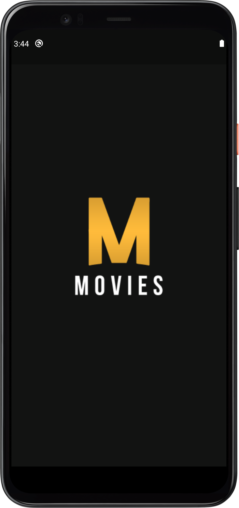
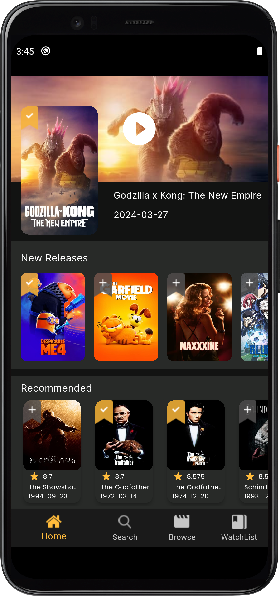
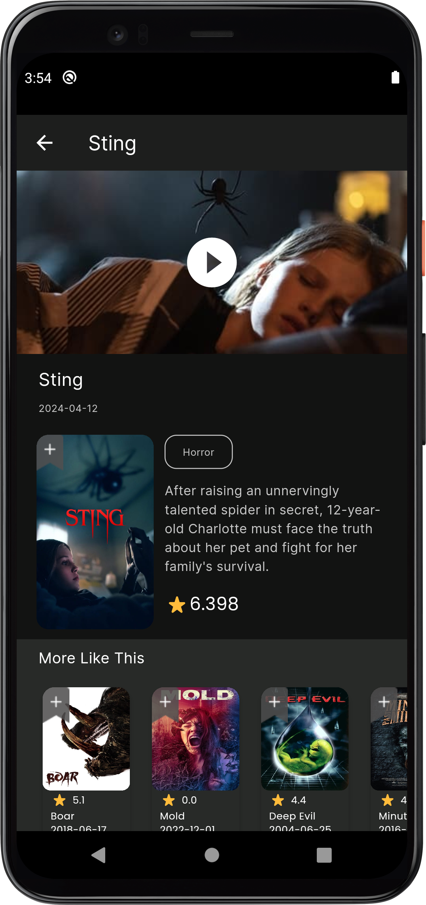
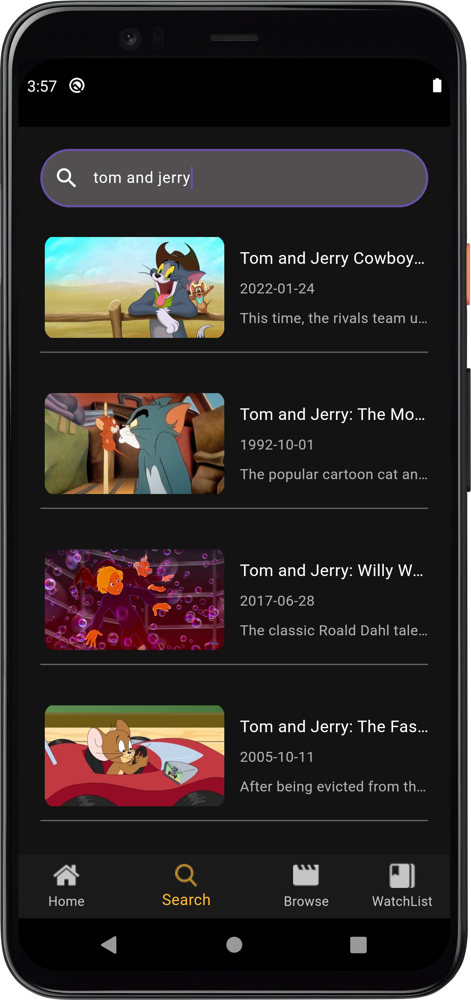
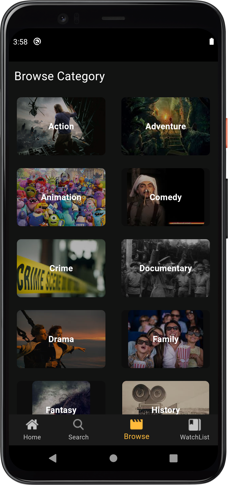
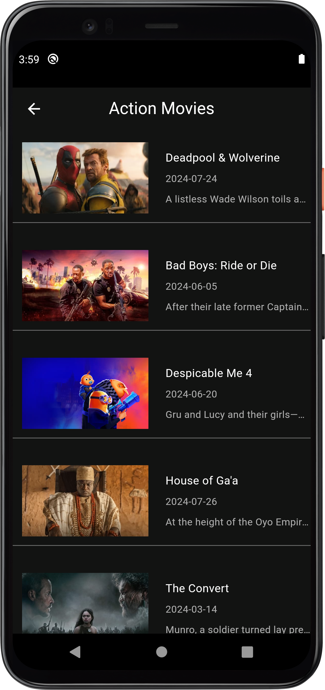
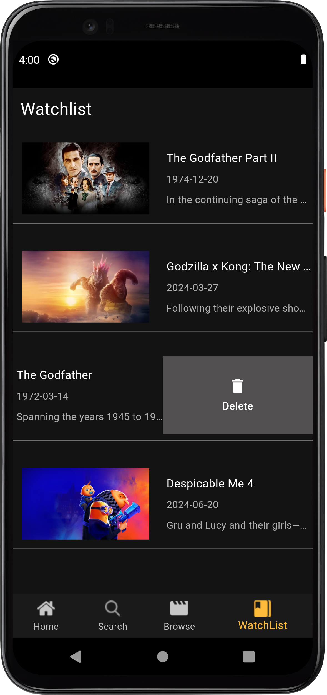
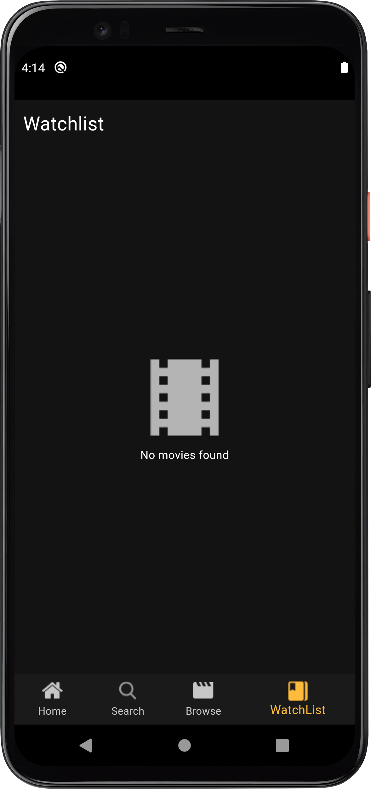

# Movies App

## Description
The Movies App is a mobile application built using Flutter that allows users to access the latest and recommended movies from a movies API. The app fetches movie data from the API and displays it to the user. The app also integrates with Firebase for offline data storage and user's watchlist.

## Features
1. Movie Feed: The app displays the latest and recommended movies from the movies API.
2. Offline Access: The app saves the movie data offline using Firebase, allowing users to access movies even when they are offline.
3. Search: Users can search for movies by keyword.
4. Watchlist: Users can add movies to their watchlist, which is stored in Firebase.
5. Categories: Users can browse movies by different categories.

## Technologies Used
- Flutter
- Dart
- MVVM 
- Movies API
-  Cubit (for state management)
- Firebase (for offline data storage and user's watchlist)

## Screenshots
       

     

## Contact
If you have any questions or feedback, please feel free to reach out to the project maintainers:
- Ahmed Mohsen : ahmedmohsen2492@gmail.com
- Ebrahim Tarek : ebrahimtarek2002@gmail.com

